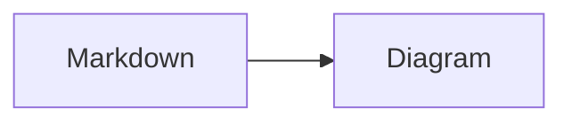

# Welcome to Meowdown

A hybrid Markdown editor that renders as you type, so you never break your flow.

Weave in **bold**, *italic*, `inline code`, or ~~strikethrough~~ without reaching for a toolbar.

Drop a [link](https://github.com/prosekit/meowdown) and keep on writing.

Label your notes with tags like #meow and #markdown. Type `#` followed by a letter to see suggestions.

Connect notes with wikilinks like [[Daily journal]] and [[Reading list]]. Type `[[` to link another note.
Select some text and click the sparkle button (or press `Mod-Shift-J`) to run a command on it. The result streams into a preview, and nothing changes until you accept it.

Track things two ways. Type `+ ` for a circle checkbox task, or `[] ` for a square checkbox task:

+ [ ] Ship the circle task
+ [x] Read the research doc
- [ ] Buy cat food
- [x] Water the plants

Outline your thoughts with nested bullets. Hover a bullet that has children and click it (or press `Mod-.`) to fold. A folded bullet is saved with a `+` marker, so it stays folded next time:

- Project ideas
  - A cozy reading nook
  - A cat-shaped bookshelf
- Groceries
  - Cat food
  - Houseplants
+ This one is already folded (click to expand)
  - Hidden child one
  - Hidden child two

Drop in an image and it renders right where you wrote it. Paste or drag one in to upload your own:

Small images flow inline <!--{"width":128,"height":128}--> with the surrounding text.

Paste a YouTube or tweet link and it embeds itself. Undo once to get the plain link back:


A link to a file renders as a tidy pill, with its size filled in by the host. Paste or drop any non-image file to add your own, and click a pill to open it:

[Meowdown press kit.zip](files/meowdown-press-kit.zip)

Write math with dollars: an inline formula like $E=mc^2$ renders in place, and a `$$` block becomes a display equation with a live preview while you edit:

$$
\int_{-\infty}^{\infty} e^{-x^2} \, dx = \sqrt{\pi}
$$

Drop in a fenced code block and pick its language from the selector:

```typescript
function greet(name: string): string {
  return `Hello, ${name}!`
}
```

Mermaid diagrams render live too:



| table | syntax | is | supported |
| ----- | ------ | -- | --------- |
| even  | **in** | *tables* too! | :D |

> Switch modes above to choose how much Markdown syntax stays in view.
