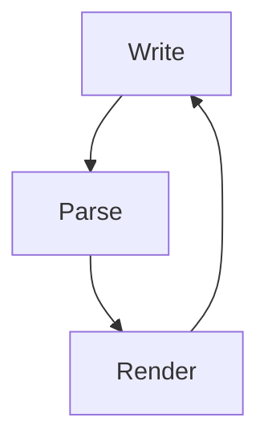

# Code and math

Inline code with tricky backticks: `simple`, ``a `nested` backtick``, and `unclosed$dollar`.

A TypeScript block:

```typescript
interface Point {
  x: number
  y: number
}

export function distance(a: Point, b: Point): number {
  return Math.hypot(a.x - b.x, a.y - b.y)
}
```

A Python block:

```python
def fib(n: int) -> int:
    a, b = 0, 1
    for _ in range(n):
        a, b = b, a + b
    return a
```

A block with an unknown language tag:

```meowscript
purr {
  nap for 8 hours
}
```

A block with no language at all:

```
plain preformatted text
	with a hard tab inside
```

A Mermaid diagram:



Inline math: $E=mc^2$, $\alpha + \beta = \gamma$, and a fraction $\frac{1}{2}$.

Display math:

$$
\int_{-\infty}^{\infty} e^{-x^2} \, dx = \sqrt{\pi}
$$

$$
\begin{aligned}
\nabla \cdot \mathbf{E} &= \frac{\rho}{\varepsilon_0} \\
\nabla \cdot \mathbf{B} &= 0
\end{aligned}
$$

Math right next to code: the constant `TAU` equals $2\pi$.
